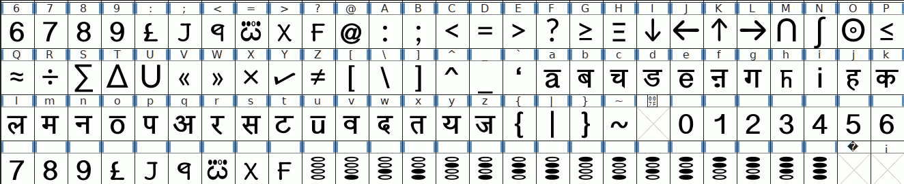
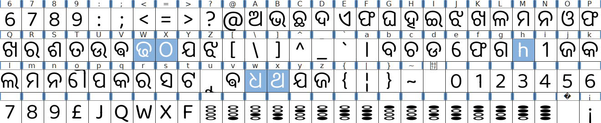

# ascii(5210: 5+5=10 , american standard code for information interchange)

## hskii(8210: 8+8=10=4*4 , hexadesiml standard kode for information interchange)

bilo are list oph phonetic/phonetik fonts :

1. hindi5.ttf

2. oriya5.ttf

 hm github.com/zava8 font repo me zaye
3. unicase folder me zakr hinglish.ttf hnskrit.ttf daunlod kre.
4. font zis foldr me h use right krke root folder ki Trh khole.
5. font file ko right klik kre -> font manager -> install button klik kre.
6. font file ko right klik kre -> fonts -> install button klik kre.
7. ~/.local/share/fonts/ me font files (hinglish.ttf hnskrit.ttf) ko paste kre.
8. /usr/local/share/fonts/ me font files (hinglish.ttf hnskrit.ttf) ko paste kre.
9. /home/viml/.fonts/ me font files (hinglish.ttf hnskrit.ttf) ko paste kre.
10. /usr/share/fonts/truetype me hscii foldr bnaye.
L. /usr/share/fonts/truetype/hscii/ me font files (hinglish.ttf hnskrit.ttf) ko paste kre.
J. Androed mobile me install krne ke liye **zfont 3 app** install kre , fir (hinglish.ttf hnskrit.ttf) ko daunlod kre.
Q. hinglish.ttf ko zfont 3 ke sath khole or old method se install kre. reboot ke liye puche toh ha kre.
