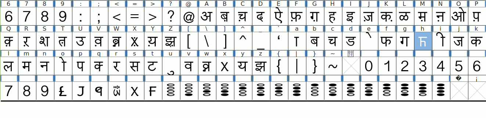
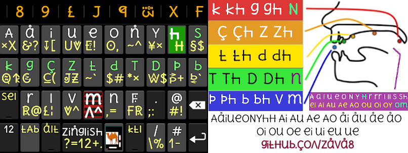
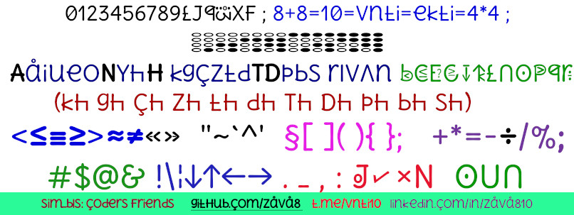

# hscii810 hinDi fonts & hinDi hpop & mtr88 keyboArd

1. hinDi52h font ko instal  krne ke liye Apne mobile/pc/lAptop me [daunlod hinDi52h.ttf](./hinDi52h.ttf) kiziye.
2. Android mobile me install krne ke liye [Android app zfont 3](https://play.google.com/store/apps/details?id=com.htetznaing.zfont2) ke saTh **method 1 old** ka upyog kre
3. linux me install krne font zis folder me daunlod kiye h use root access ke saTh khole.
4. vindoz me font install krne ke liye font file ko right klik krke **install** select kre.

## hinDi52 fonts

[hinDi online sikhe](http://zinglish.vercel.app)

[firefox ztr Addon](https://addons.mozilla.org/en-US/firefox/addon/ztr/) se hinDi Tmil mlyalm knrra mrathi guzraTi urriya Telugu pnzabi ko **trnsliterate kre**

