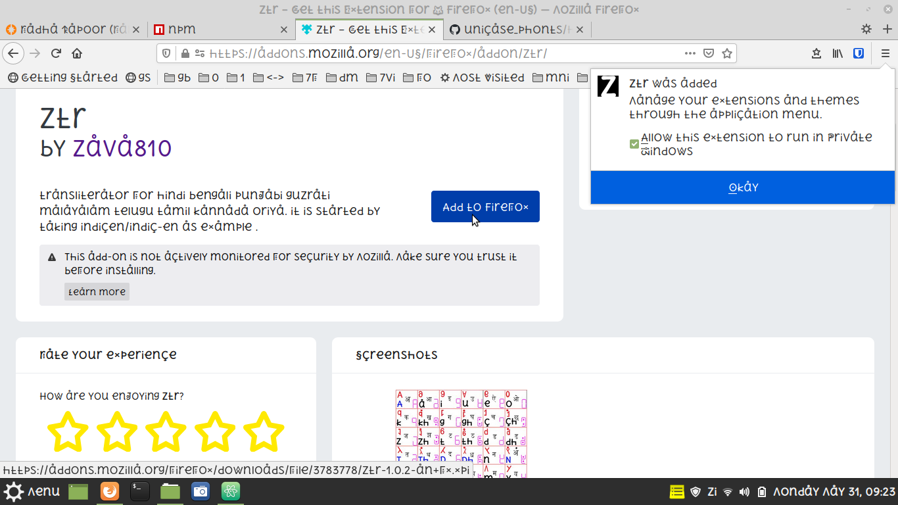

##### 2) vindouz me instal krne ke steps :
```
  1. unicase_phonts/yunikes folder me zaiyega.
  2. sbhi phonts (.ttf file) ko right_click->install as admin-> kiziyega
  3. AgAr aap ko koi smAsya aaTi h Toh [vindouz support vizit kre](https://support.microsoft.com/en-us/topic/download-and-install-custom-fonts-to-use-with-office-0ee09e74-edc1-480c-81c2-5cf9537c70ce)
```

##### steps phur installation in linuks mozilla phayrphoks
![][i1]
1. go tu settings by clicking  **gear like button in right** .
1. search fonts in  **find in preferences search boks** .
1. click **Advanced** button .
1. latin/other/bengali/telugu/punzabi/.... sbhi ke liye u5cdot phont uze kiziyega. bengali screenshot.

1. u5cdot_pnzabi_gurumukhi screenshot.

1. u5cdot_oriya.png  screenshot.

----------

#### steps phur installing ztr(zabc transliterator) in phayrphoks
1. [ztr mozilla addon open kre](https://addons.mozilla.org/en-US/firefox/addon/ztr/)
2. **Add to firefox** button click kiziyega.
3. **Add** button klick kiziyega
4. **Allo in private vindo" checkboks ko check krke **okay** button press kiziyega.

